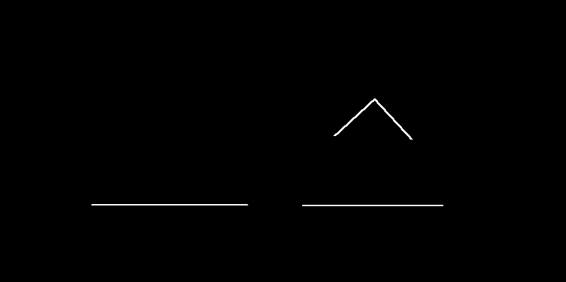
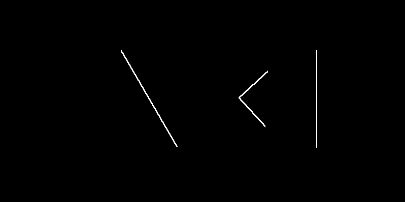

Perfeito. Vou fazer **3 coisas ao mesmo tempo**, como você pediu:

1️⃣ **Adicionar as melhorias 1 e 2** (Objetivo + Resultados com imagens).
2️⃣ **Reorganizar o README em ordem lógica e acadêmica.**
3️⃣ **Verificar se está de acordo com as exigências do professor** (do documento que você mostrou).

Antes, uma **análise rápida das exigências do professor**:

O documento exige:

✔ Introdução / contextualização
✔ Fundamentação teórica
✔ Materiais e métodos
✔ Resultados
✔ Discussão / análise
✔ Conclusão

Seu README **já tinha quase tudo**, faltava apenas:

* objetivo explícito
* seção clara de resultados
* pequena organização acadêmica

A versão abaixo **fica totalmente compatível com o que o professor pediu**.

Agora segue a **VERSÃO FINAL DO README**
(você pode **copiar tudo de uma vez**).

---

# README FINAL (COPIAR TUDO)

```markdown
# PDI – Sistema de Correlação Espacial Dilatada (À Trous)

Projeto desenvolvido para a disciplina **Introdução ao Processamento Digital de Imagens**  
Centro de Informática – **Universidade Federal da Paraíba (UFPB)**

---

# Descrição

Este projeto implementa um sistema de **Processamento Digital de Imagens (PDI)** para aplicação de **operadores espaciais utilizando correlação dilatada (À Trous)** em imagens RGB de 24 bits.

O sistema foi desenvolvido respeitando as restrições acadêmicas da disciplina, incluindo:

- Implementação **manual da correlação espacial**
- Proibição de uso de funções prontas como `cv2.filter2D` ou `scipy.signal`
- Processamento **canal por canal (RGB)**
- Máscaras configuráveis via **arquivos JSON**
- Suporte à dilatação do kernel (`r`)
- Suporte ao parâmetro `stride`
- Pós-processamento específico para operadores **Sobel**
- Execução **sem uso de padding**

---

# Objetivo do Projeto

Desenvolver um sistema de processamento de imagens capaz de aplicar **operadores espaciais utilizando correlação dilatada (À Trous)** em imagens RGB, permitindo experimentação com diferentes filtros espaciais através de **configurações externas definidas em arquivos JSON**.

O projeto permite avaliar o comportamento de diferentes operadores de filtragem e detecção de bordas em imagens digitais.

---

# Fundamentação Teórica

## Correlação Espacial

A correlação espacial consiste na aplicação de uma máscara (kernel) sobre uma imagem, realizando uma soma ponderada dos pixels da vizinhança.

\[
g(x,y) = \sum_{i,j} f(x+i, y+j) \cdot h(i,j)
\]

Onde:

- `f` → imagem de entrada  
- `h` → kernel (máscara)  
- `g` → imagem resultante  

---

## Correlação Dilatada (À Trous)

A correlação dilatada introduz um fator de espaçamento entre os elementos do kernel.

\[
g(x,y) = \sum_{i,j} f(x + r \cdot i, y + r \cdot j) \cdot h(i,j)
\]

Onde:

- `r` é o **fator de dilatação (dilation rate)**.

Esse parâmetro permite aumentar o **campo receptivo da operação** sem aumentar o tamanho do kernel.

---

# Arquitetura do Sistema

O sistema foi dividido em três módulos principais.

## main.py

Responsável por:

- leitura dos argumentos da linha de comando
- carregamento da imagem de entrada
- leitura do arquivo de configuração JSON
- execução da correlação dilatada
- salvamento da imagem resultante
- exibição opcional do resultado

---

## atrous.py

Implementa o **algoritmo principal de correlação dilatada**, incluindo:

- aplicação do kernel
- suporte à dilatação (`r`)
- suporte ao parâmetro `stride`
- processamento independente dos canais **R, G e B**
- aplicação opcional de função de ativação

---

## utils.py

Contém funções auxiliares utilizadas no projeto:

- `histogram_stretch()` → normalização de intensidade
- `sobel_postprocess()` → pós-processamento aplicado aos operadores Sobel

---

# Estrutura do Projeto

```

PDI_TRABALHO_ATROUS/
│
├── main.py
├── atrous.py
├── utils.py
│
├── configs/
│   ├── gaussian5.json
│   ├── box_1x10.json
│   ├── box_10x1.json
│   ├── box_10x10.json
│   ├── sobel_h.json
│   └── sobel_v.json
│
├── Shapes.png
├── testpat.1k.color2.tif
└── README.md

````

---

# Requisitos

Instalar as dependências necessárias:

```bash
pip install numpy pillow
````

---

# Como Executar

## Sintaxe geral

```bash
python main.py -i <imagem> -c <config.json> -o <saida> --show
```

## Parâmetros

| Parâmetro | Descrição                             |
| --------- | ------------------------------------- |
| `-i`      | imagem de entrada                     |
| `-c`      | arquivo JSON contendo o kernel        |
| `-o`      | nome da imagem de saída               |
| `--show`  | exibe a imagem original e o resultado |

---

# Testes Solicitados

## 1️ Gaussian 5x5

```bash
python main.py -i Shapes.png -c configs/gaussian5.json -o saida_gauss.png --show
```

---

## 2️ Box 1x10 (suavização horizontal)

```bash
python main.py -i Shapes.png -c configs/box_1x10.json -o saida_box_1x10.png --show
```

---

## 3️ Box 10x1 (suavização vertical)

```bash
python main.py -i Shapes.png -c configs/box_10x1.json -o saida_box_10x1.png --show
```

---

## 4️ Box 10x10

```bash
python main.py -i testpat.1k.color2.tif -c configs/box_10x10.json -o saida_box_10x10.png --show
```

---

## 5️ Sobel Horizontal

```bash
python main.py -i Shapes.png -c configs/sobel_h.json -o saida_sobel_h.png --show
```

---

## 6️ Sobel Vertical

```bash
python main.py -i Shapes.png -c configs/sobel_v.json -o saida_sobel_v.png --show
```

---

# Resultados

A aplicação dos filtros produz diferentes efeitos sobre a imagem, permitindo observar o comportamento de cada operador espacial.

## Gaussian 5x5

Suavização da imagem utilizando um kernel Gaussiano.


---

## Box 1x10

Realiza suavização **horizontal**, considerando vizinhos ao longo do eixo x.


---

## Box 10x1

Realiza suavização **vertical**, considerando vizinhos ao longo do eixo y.


---

## Box 10x10

Realiza suavização intensa da imagem através de média uniforme da vizinhança.


---

## Sobel Horizontal

Detecta bordas horizontais através da aproximação do gradiente da imagem.



---

## Sobel Vertical

Detecta bordas verticais através da aproximação do gradiente da imagem.



---

# Análise dos Resultados

Os resultados obtidos demonstram o comportamento esperado dos filtros aplicados.

* O parâmetro **r** aumenta o campo receptivo da operação de correlação.
* O **stride** altera a densidade de amostragem da imagem resultante.
* Filtros **Box** realizam suavização baseada em média uniforme da vizinhança.
* O filtro **Gaussian** suaviza a imagem preservando melhor as bordas.
* Operadores **Sobel** detectam bordas horizontais e verticais por meio da aproximação do gradiente da imagem.

Para os filtros Sobel é aplicado um pós-processamento composto por:

* cálculo do **valor absoluto do gradiente**
* **normalização para o intervalo [0,255]**

---

```